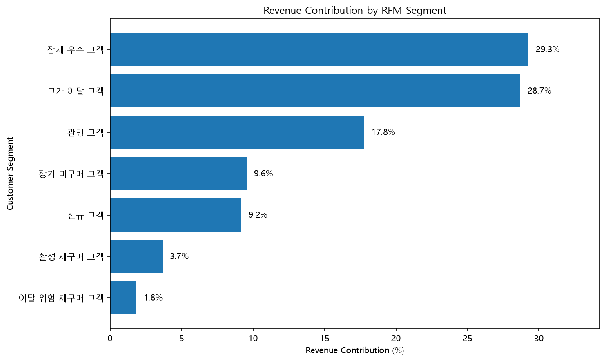
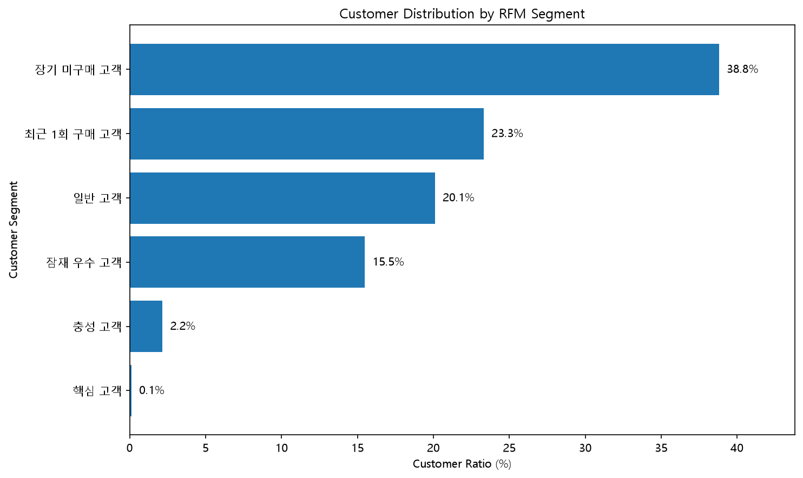
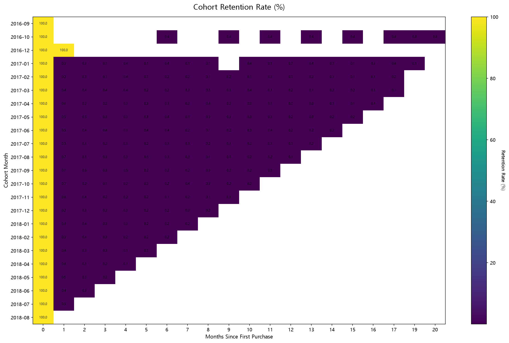

# Olist E-commerce 고객 재구매 분석

브라질 이커머스 플랫폼 Olist의 주문 데이터로 **고객의 구매 행동과 재구매 패턴을 분석**하고, 고객 유지 및 매출 개선 전략을 도출한 데이터 분석 포트폴리오입니다.

## 분석 질문

1. 재구매율은 얼마나 되며, 재구매 고객은 매출에 얼마나 기여하는가?
2. 고객을 구매 행동에 따라 어떻게 나눌 수 있고, 어느 그룹에 먼저 투자해야 하는가?
3. 신규 고객은 시간이 지나도 다시 돌아오는가?

## 핵심 결과

| 지표 | 결과 |
|---|---|
| 분석 기간 | 2016-09 ~ 2018-08 (배송 완료 주문 기준) |
| 매출 (상품 금액) | 13,221,498.11 |
| 주문 금액 (상품 + 배송비) | 15,419,773.75 |
| 주문 수 | 96,478 |
| 평균 주문 금액 (AOV) | 137.04 |
| 고객 수 | 93,358 |
| 재구매 고객 | 2,801명 (약 3.0%) |
| 재구매 고객 매출 기여 | 약 5.6% |

- **재구매율이 약 3%로 매우 낮습니다.** 대부분의 고객은 한 번 구매하고 다시 돌아오지 않습니다.
- **코호트 분석에서도 같은 패턴이 확인됩니다.** 표본이 충분한 2017-01 ~ 2018-07 코호트의 첫 구매 1개월 후 재구매 비율은 0.2~0.7% 수준(평균 약 0.5%)입니다.
- **고가 이탈 고객이 가장 큰 기회입니다.** 한 번 높은 금액을 구매하고 오래 구매하지 않은 고객 13,646명이 전체 구매금액의 약 28.7%를 차지합니다.

## RFM 고객 세그먼트

1회 구매 고객이 약 97%라서 일반적인 5분위 방식만으로는 고객이 구분되지 않습니다. 먼저 **재구매 여부(Frequency)** 로 나눈 뒤, 그 안에서 **최근성(Recency)** 과 **구매금액(Monetary)** 으로 세분화했습니다. 모든 고객은 정확히 하나의 세그먼트에 속합니다.

| 세그먼트 | 조건 | 고객 수 | 고객 비율 | 구매금액 비율 |
|---|---|---|---|---|
| 잠재 우수 고객 | 1회 구매, 최근, 높은 금액 | 14,452 | 15.5% | 29.3% |
| 고가 이탈 고객 | 1회 구매, 오래전, 높은 금액 | 13,646 | 14.6% | 28.7% |
| 관망 고객 | 1회 구매, 마지막 구매 후 약 6~9개월 | 18,105 | 19.4% | 17.8% |
| 장기 미구매 고객 | 1회 구매, 오래전, 낮은 금액 | 22,582 | 24.2% | 9.6% |
| 신규 고객 | 1회 구매, 최근, 낮은 금액 | 21,772 | 23.3% | 9.2% |
| 활성 재구매 고객 | 2회 이상, 최근 | 1,813 | 1.9% | 3.7% |
| 이탈 위험 재구매 고객 | 2회 이상, 오래전 | 988 | 1.1% | 1.8% |





## 전략 제안

분석 결과를 바탕으로 한 제안이며, 실제 효과는 A/B 테스트 등으로 검증이 필요합니다.

| 대상 | 제안 |
|---|---|
| 고가 이탈 고객 | 재방문 유도(Win-back) 캠페인의 최우선 대상. 이전 구매 카테고리 기반 쿠폰·추천 |
| 잠재 우수 고객 | 최근 구매 직후 재구매를 유도하는 후속 프로모션으로 두 번째 구매 전환 |
| 신규 고객 | 첫 구매 후 일정 기간 내 재구매 혜택으로 초기 재구매율 개선 |
| 관망 고객 | 이탈 직전 단계이므로 리마인드 알림·한정 혜택으로 이탈 방지 |
| 활성 재구매 고객 | 규모는 작지만 재구매 행동을 이미 보인 그룹. 리뷰·추천 프로그램 등 관계 유지 |

## Cohort 분석

고객의 첫 구매 월을 기준으로 월별 재구매 유지율을 계산했습니다. 2016년 코호트(2016-09, 10, 12)는 고객이 1~262명으로 표본이 작아 히트맵에서 제외하고, 2017-01 이후 코호트만 표시했습니다.



## 분석 기준

- 배송 완료(`delivered`) 주문만 분석 대상으로 사용했습니다.
- 고객은 `customer_unique_id` 기준으로 집계했습니다. (`customer_id`는 주문마다 새로 발급됩니다.)
- 매출은 상품 금액(`price`) 기준이고, 주문 금액은 상품 금액 + 배송비입니다. 재구매 고객 매출 기여(5.6%)는 주문 금액 기준, RFM의 구매금액은 상품 금액 기준입니다.
- RFM 기준일은 데이터의 마지막 구매일입니다.

## 기술 스택

- **Python** (pandas, matplotlib): 데이터 전처리, RFM·Cohort 분석, 시각화
- **DuckDB / SQL**: 매출·고객·상품 KPI 분석
- **Tableau**: 대시보드
- **Git / GitHub**: 버전 관리

## 폴더 구조

```
ecommerce-customer-analysis/
├─ data/
│  ├─ raw/            # 원본 데이터 (저장소에 포함하지 않음)
│  └─ processed/      # 전처리·분석 결과 CSV
├─ sql/
│  ├─ 01_sales_kpi.sql
│  ├─ 02_customer_kpi.sql
│  └─ 03_product_kpi.sql
├─ python/            # 01~11 분석 스크립트
├─ dashboard/         # Tableau용 CSV
├─ images/            # 분석 결과 이미지
└─ requirements.txt
```

## 실행 방법

1. [Kaggle의 Olist 데이터셋(Brazilian E-Commerce Public Dataset by Olist)](https://www.kaggle.com/datasets/olistbr/brazilian-ecommerce)을 내려받아 `data/raw/`에 CSV 파일을 넣습니다. 데이터 사용 조건은 Kaggle 페이지를 확인하세요.
2. 패키지를 설치합니다.
   ```bash
   pip install -r requirements.txt
   ```
3. 스크립트를 순서대로 실행합니다.

| 순서 | 스크립트 | 내용 |
|---|---|---|
| 01 | `01_data_quality_check.py` | 결측치·중복 등 데이터 품질 확인 |
| 02 | `02_data_relationship_check.py` | 테이블 관계, 주문 상태, 재구매 여부 확인 |
| 03 | `03_preprocessing.py` | 배송 완료 주문 기준 전처리 |
| 04 | `04_run_sql.py` | `sql/` 폴더의 KPI 쿼리 실행 |
| 05 | `05_rfm_analysis.py` | 고객별 R, F, M 계산 |
| 06 | `06_rfm_scoring.py` | RFM 점수화 |
| 07 | `07_rfm_segmentation.py` | 고객 세그먼트 분류 |
| 08 | `08_rfm_visualization.py` | RFM 시각화 |
| 09 | `09_cohort_analysis.py` | Cohort 유지율 계산 |
| 10 | `10_cohort_visualization.py` | Cohort 히트맵 |
| 11 | `11_dashboard_data.py` | Tableau용 데이터 생성 |

> 시각화 스크립트(08, 10)는 한글 폰트로 `Malgun Gothic`(Windows)을 사용합니다. 다른 환경에서는 폰트 설정을 변경해야 합니다.